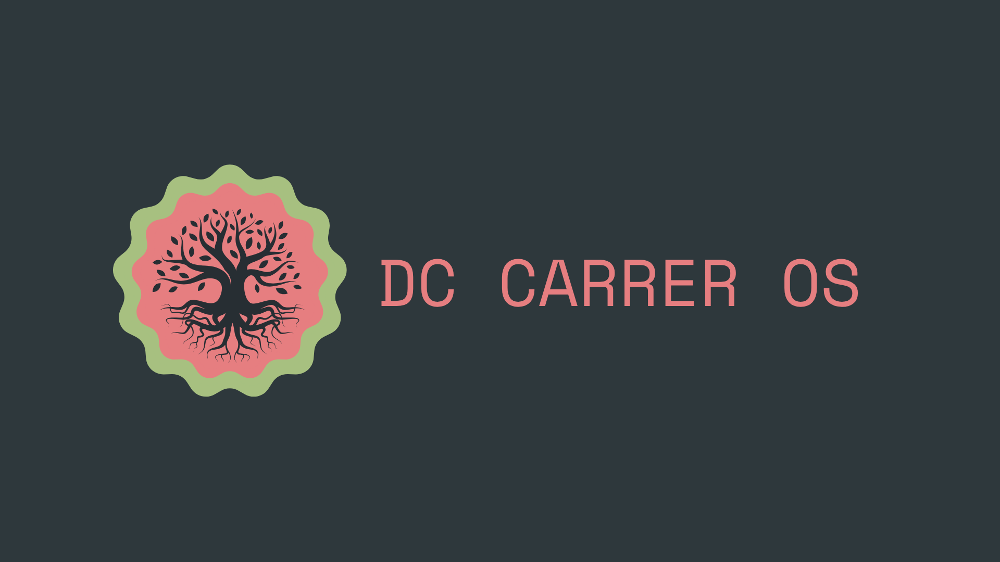

<p align="center">
  
</p>

<h1 align="center">DC Career OS</h1>

<p align="center">
  <strong>Building my journey toward becoming a Data Center Engineer.</strong>
</p>

---

## About

This repository documents my complete journey from engineering student to professional Data Center Engineer.

It serves as my engineering knowledge base, home lab documentation, certification tracker, and career portfolio.

---

## Current Focus

- DCCA Certification
- Linux Administration
- Home Lab Development
- CCNA Fundamentals
- CompTIA Server+
- Cloud Infrastructure
- Technical Documentation
- Internship Preparation

---

## Home Lab

| System | Description |
|---------|-------------|
| Proxmox Host | Virtualization Platform |
| VM100 | Ubuntu Server |
| VM101 | Ubuntu Server |
| Lenovo Ubuntu Server | Bare Metal Linux Server |
| Tailscale | Secure Remote Access |
| Airtel Router | Home Network |

---

## Repository Structure

```text
dc-career-os/
├── dcca-notes/
├── homelab/
├── daily-journal/
├── event-tracker/
├── job-tracker/
├── resume/
└── screenshots/
```

---

## Career Goal

- Become a Data Center Engineer
- Gain production infrastructure experience
- Complete DCCA, CCNA, and Server+
- Build a production-quality home lab
- Join a hyperscale or colocation data center
- Continue documenting every project

---

## Progress

- [x] GitHub Repository Created
- [x] Home Lab Setup
- [x] Ubuntu Servers Deployed
- [x] Tailscale Configured
- [ ] Complete DCCA
- [ ] Complete CCNA
- [ ] Complete Server+
- [ ] First Data Center Internship
- [ ] First Data Center Engineer Role
